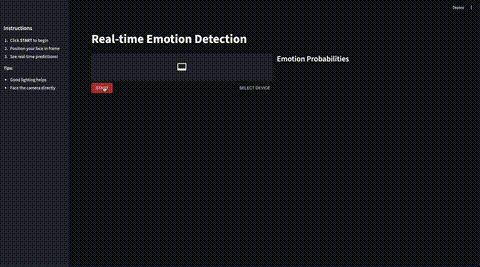

# Real-time Face Emotion Detection



A real-time facial emotion detection application using deep learning. The system detects faces in video streams and classifies emotions into 7 categories: Angry, Disgust, Fear, Happy, Neutral, Sad, and Surprise.

## Quick Start with Docker

```bash
# Build the image
docker build -t face-emotion-detection .

# Run the container
docker run -p 8000:8000 -p 8501:8501 face-emotion-detection

# Access the app
# Frontend: http://localhost:8501
# API Docs: http://localhost:8000/docs
```

## Architecture Overview

```
┌─────────────────┐     ┌─────────────────┐     ┌─────────────────┐
│   Streamlit     │────▶│   FastAPI       │────▶│   PyTorch       │
│   Frontend      │     │   Backend       │     │   Models        │
│   (WebRTC)      │◀────│   /infer API    │◀────│   MTCNN + CNN   │
└─────────────────┘     └─────────────────┘     └─────────────────┘
```

## Core Concepts

### Convolutional Neural Networks (CNNs)

CNNs are the backbone of modern computer vision. They work by:

1. **Convolution Layers**: Apply learnable filters to detect features (edges, textures, patterns)
2. **Pooling Layers**: Reduce spatial dimensions while retaining important information
3. **Fully Connected Layers**: Combine features for final classification

```
Input Image → [Conv → ReLU → Pool] × N → Flatten → FC → Softmax → Prediction
```

### Face Detection: MTCNN

**Multi-task Cascaded Convolutional Networks (MTCNN)** is a pre-trained model for face detection that uses three stages:

1. **P-Net (Proposal Network)**: Quickly scans image for candidate face regions
2. **R-Net (Refine Network)**: Filters false positives and refines bounding boxes
3. **O-Net (Output Network)**: Final refinement and facial landmark detection

We use MTCNN from `facenet-pytorch` to detect face bounding boxes before emotion classification.

### Emotion Classification: EfficientNet-B0

**EfficientNet** is a family of models that achieve state-of-the-art accuracy with fewer parameters through:

- **Compound Scaling**: Balances network depth, width, and resolution
- **Mobile Inverted Bottleneck (MBConv)**: Efficient building blocks with depthwise separable convolutions

Our model fine-tunes EfficientNet-B0 with a custom classifier head:

```
EfficientNet-B0 (pretrained) → FC(1280→512) → ReLU → Dropout(0.4) → FC(512→7) → Softmax
```

## Tech Stack

| Component        | Technology                   |
| ---------------- | ---------------------------- |
| Frontend         | Streamlit + streamlit-webrtc |
| Backend          | FastAPI + Uvicorn            |
| Face Detection   | MTCNN (facenet-pytorch)      |
| Emotion Model    | EfficientNet-B0 (PyTorch)    |
| Data Processing  | OpenCV, PIL, NumPy           |
| Containerization | Docker                       |

## Project Structure

```
face-emotion-detection/
├── backend/
│   ├── app.py                    # FastAPI application
│   ├── models.py                 # Pydantic response models
│   ├── utils.py                  # Model loading & inference
│   ├── train_v2.ipynb            # Training notebook
│   └── efficientnet_b0_*.pt      # Trained model weights
├── frontend/
│   └── app.py                    # Streamlit application
├── .env.example                  # Training configuration template
├── requirements.txt              # Python dependencies
├── Dockerfile                    # Container configuration
└── README.md
```

## API Endpoints

### POST /infer

Perform face detection or emotion classification.

**Parameters:**

- `file`: Image file (JPEG, PNG)
- `model_type`: `"face"` or `"emotion"`

**Response (face):**

```json
{
  "boxes": [[x1, y1, x2, y2], ...]
}
```

**Response (emotion):**

```json
{
  "probabilities": {
    "angry": 0.05,
    "disgust": 0.02,
    "fear": 0.03,
    "happy": 0.75,
    "neutral": 0.1,
    "sad": 0.03,
    "surprise": 0.02
  }
}
```

## Training Your Own Model

### 1. Download Dataset

Download the FER2013 dataset from Kaggle:
https://www.kaggle.com/datasets/jonathanoheix/face-expression-recognition-dataset

Extract to `images/` folder:

```
images/
├── train/
│   ├── angry/
│   ├── disgust/
│   ├── fear/
│   ├── happy/
│   ├── neutral/
│   ├── sad/
│   └── surprise/
└── validation/
    └── ...
```

### 2. Configure Training Parameters

Copy and edit the environment file:

```bash
cp .env.example .env
```

Adjustable parameters:
| Parameter | Default | Description |
|-----------|---------|-------------|
| `LEARNING_RATE` | 0.001 | Initial learning rate |
| `BATCH_SIZE` | 32 | Training batch size |
| `NUM_EPOCHS` | 22 | Number of training epochs |
| `DROPOUT_RATE` | 0.4 | Dropout for regularization |
| `OPTIMIZER` | adamw | adamw, adam, or sgd |
| `LR_STEP_SIZE` | 7 | Epochs before LR decay |
| `LR_GAMMA` | 0.1 | LR decay factor |
| `IMAGE_SIZE` | 256 | Input image dimensions |

### 3. Run Training

```bash
cd backend
pip install python-dotenv
jupyter notebook train_v2.ipynb
```

## Key Takeaways

1. **Transfer Learning**: Using pre-trained models (EfficientNet) dramatically reduces training time and data requirements

2. **Two-Stage Pipeline**: Separating face detection (MTCNN) and emotion classification allows each model to specialize

3. **Imbalanced Data Handling**: Using `ImbalancedDatasetSampler` ensures the model sees all emotion classes equally during training

4. **Real-time Processing**: Frame skipping and result caching enable smooth real-time performance

5. **Microservices Architecture**: Separating frontend and backend allows independent scaling and deployment

## Performance

- **Training Accuracy**: ~85%
- **Validation Accuracy**: ~70%
- **Inference Time**: ~100ms per frame (CPU)

## Running Locally (Without Docker)

```bash
# Install dependencies
pip install -r requirements.txt

# Terminal 1: Start backend
cd backend && uvicorn app:app --host 0.0.0.0 --port 8000

# Terminal 2: Start frontend
cd frontend && streamlit run app.py
```

## License

MIT License
